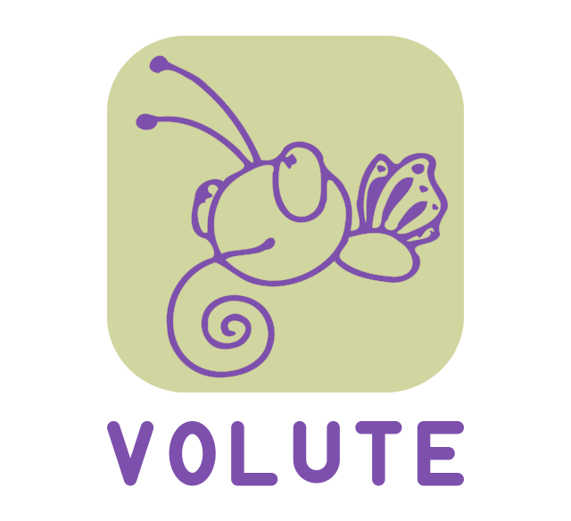

# VOLUTE

**V**ideo **O**bject **L**abeling, **U**ser-guided **T**racking and **E**xtraction

<p align="center">
  <picture>
    <source media="(prefers-color-scheme: dark)" srcset="docs/lockup_dark.svg">
    
  </picture>
</p>

A PyQt5 desktop application for interactive and batch video segmentation and point tracking, built on
[SAM2](https://github.com/facebookresearch/segment-anything-2),
[MedSAM2](https://github.com/bowang-lab/MedSAM2), and
[SAM2++](https://github.com/MCG-NJU/SAM2-Plus).

Load a folder of frames, define objects with points, boxes or imported masks, propagate them through the
sequence, then export masks, coordinates, centroids and contours. Everything runs locally.

Developed for research in speech sciences, where it serves to track articulatory and facial structures
across video frames, but nothing in it is specific to that field.

<!-- A screenshot of the main window goes well here. docs/banner.png is the GitHub social preview,
     uploaded under Settings › General › Social preview. -->

## Features

- **Three ways to define an object**, freely combinable: positive/negative points, an optional bounding box, or an externally composed mask imported from any image editor
- **Multi-object tracking** with per-object colors, markers and names, bulk editing across a multi-selection, and bidirectional propagation through the whole sequence
- **Correction workflow**: refine any already-tracked frame, then re-propagate that object alone over a bounded span
- **GIMP round-trip**: export a frame (or all frames) for external editing as `.xcf` or plain images, and import the edited masks back
- **Reference points and imported point trajectories**, with interpolation, plus distance and containment analyses against the tracked masks
- **Exports**: masked images, mask coordinates, centroids, convex hulls, outer contours, closest-point distances — in JPEG, JSON, CSV, XLSX or Pickle
- **Batch processing** of many (project, image folder) pairs without user interaction
- **Undo/redo** across points, boxes, object edits and display properties
- **Bilingual UI** (English / French), switchable at runtime, with every setting editable from a settings dialog. A further language takes no code change: drop a TSV file into `volute/translations/` and it appears in the Language menu — see the [translation guide](volute/translations/translation_readme.md)

## Requirements

- Python 3.10+ and PyTorch (CUDA, Apple Silicon MPS, or CPU)
- A working SAM2, MedSAM2 or SAM2++ installation with its checkpoints
- PyQt5, matplotlib, NumPy, Pillow, SciPy; optional: pandas + openpyxl for XLSX export, scikit-image or OpenCV for contours, GIMP 3.0+ for the editing round-trip

## Installation

1. Install SAM2 (or SAM2++/MedSAM2) and download the checkpoints
2. Install the GUI dependencies
3. Copy this repository's contents into the `tools/` directory of your SAM2 installation:

```bash
# From within your SAM2 installation
git clone https://github.com/nicolasaudibert/VOLUTE.git ../VOLUTE-src
rsync -a --exclude .git ../VOLUTE-src/ tools/
```

`tools/` already holds the files SAM2 ships there, and `git clone` refuses a destination that
is not empty, so it cannot clone into `tools/` directly. Keeping the clone makes updating
a `git pull` away, followed by the same `rsync`.

Step-by-step instructions for every backend are in **[INSTALL.md](INSTALL.md)**.

## Launching

Run from the root of your SAM2 installation. Started without options, the application first
asks which model to use; passing one on the command line skips that dialog:

```bash
python tools/VOLUTE.py                                # asks, or uses the default model
python tools/VOLUTE.py --model medsam2                # MedSAM2
python tools/VOLUTE.py --model sam2plus               # SAM2++, mask mode
python tools/VOLUTE.py --model sam2plus --task point  # SAM2++, point tracking
```

Ready-made launchers for every model can be generated with `install_launchers_Unix_MacOS.sh`
(macOS/Linux) or `install_launchers_windows.bat`. On macOS, `install_app_bundle_macos.sh`
additionally builds a double-clickable `.app`.

## Getting started

A first pass over a sequence, from an empty window to exported masks:

1. **Pick a model.** Started without options the application asks; `--model` skips the dialog.
2. **Load the frames.** **File › Select image folder** (`Ctrl+D`, `⌘D`) and choose a folder of
   images — one file per frame, in filename order. Navigate with the slider or the frame
   spinbox below the canvas.
3. **Create an object.** **Add object** in the Objects tab. Give it a name and a colour, or
   keep the defaults.
4. **Point at it.** With *Add points* mode active, left-click inside the object. Right-click
   (or `Ctrl`-click) marks what to leave out. A bounding box, drawn in *Define box* mode,
   can be combined with the points or replace them.
5. **Segment the frame.** **Predict masks on current image**. Adjust by adding points and
   predicting again until the mask is right.
6. **Follow it through the sequence.** **Propagate masks through video** tracks the object
   forwards from this frame, then backwards if it is not the first.
7. **Correct where needed.** Move to a frame the tracking got wrong, add points there, predict,
   then re-propagate that object alone from that frame.
8. **Export.** Masked images (`Ctrl+Shift+I`), or coordinates, centroids, hulls and contours
   from the Export menu.

Repeat steps 3 to 6 for each object; they are tracked together. **File › Export project data**
(`Ctrl+S`) saves the whole session to a `.volute` file to resume later.

## Documentation

**[DOCUMENTATION.md](DOCUMENTATION.md)** covers the whole application: every feature, the interaction
model, the UI layout, keyboard shortcuts, export and file formats, batch processing, localization, and
an architecture overview of the modules.

**[CHANGELOG.md](CHANGELOG.md)** lists what changed between versions.

## License

Distributed under the [GNU General Public License v3.0](https://www.gnu.org/licenses/gpl-3.0.html).

## Credits

Developed by **[Nicolas Audibert](https://lpp.cnrs.fr/nicolas-audibert/)** with [Claude](https://claude.ai)
(Anthropic) as an AI pair-programming assistant. The logo was created by Solène Bodiou.

This application builds on SAM 2 by Meta AI Research; please cite it in academic work, along with
MedSAM2 or SAM 2++ if you use those backends. Full BibTeX entries are in
[DOCUMENTATION.md](DOCUMENTATION.md#credits-and-acknowledgements) and in the application's
**Help › About** dialog.
